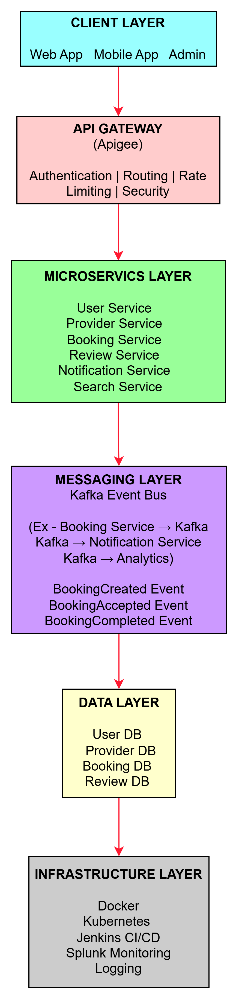

# ServiceHub Platform Architecture

## 1. System Overview

ServiceHub is a microservices-based platform that allows users to find nearby service providers such as carpenters, electricians, and plumbers.

The system enables:

- Users to search service providers
- Service providers to register and manage services
- Customers to book appointments
- Notifications for bookings
- Analytics for platform usage

The platform is built using a modern cloud-native architecture with microservices, event-driven communication, and containerized deployments.

---

## 2. Architecture Principles

The system is designed using the following principles:

- Microservices architecture
- Event-driven communication
- API-first design
- Cloud-native deployment
- High availability and scalability
- Independent service deployment

---

## 3. High Level Architecture

Main components:

- Client Applications
- API Gateway
- Microservices
- Messaging Layer (Kafka)
- Data Layer
- Infrastructure Layer

---

## 4. Microservices

The platform consists of the following services.

| Service | Responsibility |
|------|------|
User Service | User registration, login, profile management |
Provider Service | Service provider registration and management |
Booking Service | Booking creation and management |
Review Service | Customer ratings and reviews |
Notification Service | Email/SMS notifications |
Search Service | Find nearby providers |

Each service owns its own database.

---

## 5. Microservice Interaction

Communication patterns:

- REST APIs for synchronous communication
- Kafka events for asynchronous communication

Example flow:

1. User creates booking
2. Booking Service stores booking
3. Booking Service publishes `BookingCreated` event
4. Notification Service sends notification

---

## 6. Event Driven Architecture

Kafka is used for:

- Decoupled communication
- Event streaming
- Asynchronous processing

Example events:

- BookingCreated
- BookingAccepted
- BookingCompleted
- BookingCancelled

---

## 7. Deployment Architecture

Services are containerized using Docker and deployed using Kubernetes.

Deployment components:

- Kubernetes Pods
- Kubernetes Services
- Ingress Controller
- Kafka Cluster
- Databases

---

## 8. CI/CD Pipeline

Deployment pipeline:

1. Developer pushes code to GitHub
2. Jenkins pipeline builds the application
3. Docker image is created
4. Image pushed to Docker registry
5. Kubernetes deployment updated

---

## 9. Scalability Strategy

The system supports scaling through:

- Kubernetes horizontal pod autoscaling
- Stateless microservices
- Kafka partitioning
- Database indexing

---

## 10. Reliability Strategy

Reliability is achieved using:

- Retry mechanisms
- Circuit breakers
- Health checks
- Logging and monitoring

Tools used:

- Splunk for logs
- Kubernetes probes
- Alerting systems

---

## 11. Security Architecture

Security is implemented using:

- API Gateway authentication
- JWT tokens
- Role based access control
- Secure communication via HTTPS

---

## 12. Future Enhancements

Possible future improvements:

- AI based provider recommendation
- Dynamic pricing
- Mobile application
- Real-time tracking