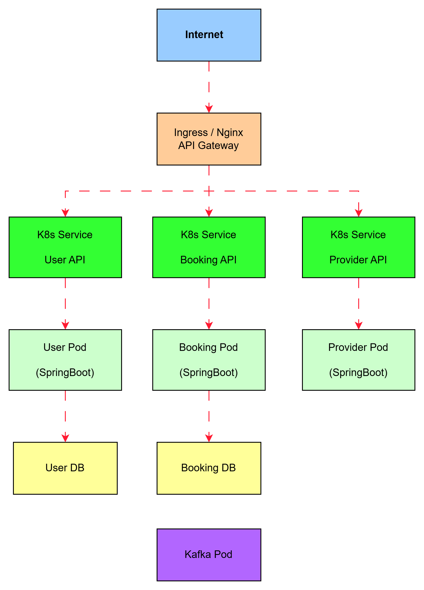
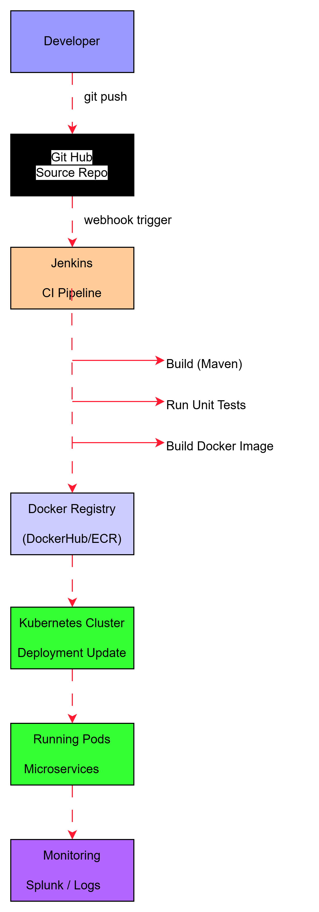

# Deployment Architecture

The platform will be deployed using containerized
microservices.

## Components

Containers
- Each service runs in its own Docker container

Orchestration
- Kubernetes manages container deployment

CI/CD
- Jenkins pipelines build and deploy services
  

Monitoring
- Splunk collects application logs