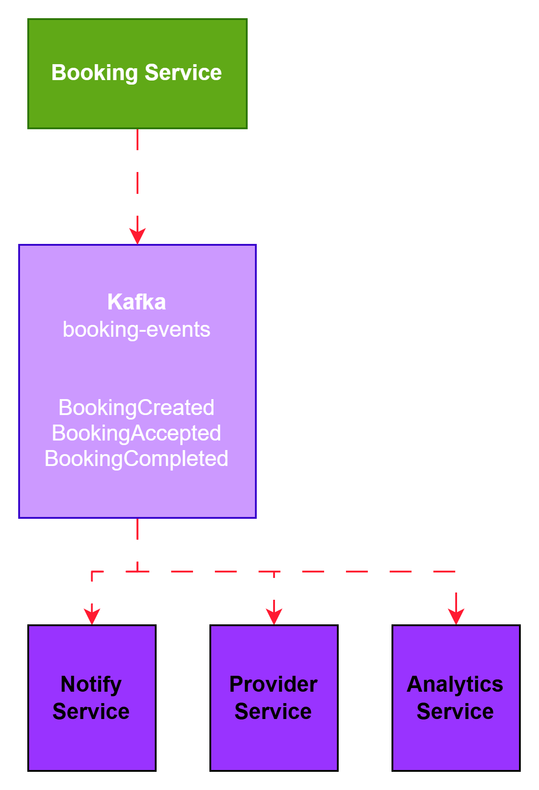

# Event Driven Architecture

The platform uses Kafka to enable asynchronous
communication between services.

## Example Flow

1. User creates a booking
2. Booking Service publishes BookingCreated event
3. Notification Service consumes the event
4. Provider receives notification