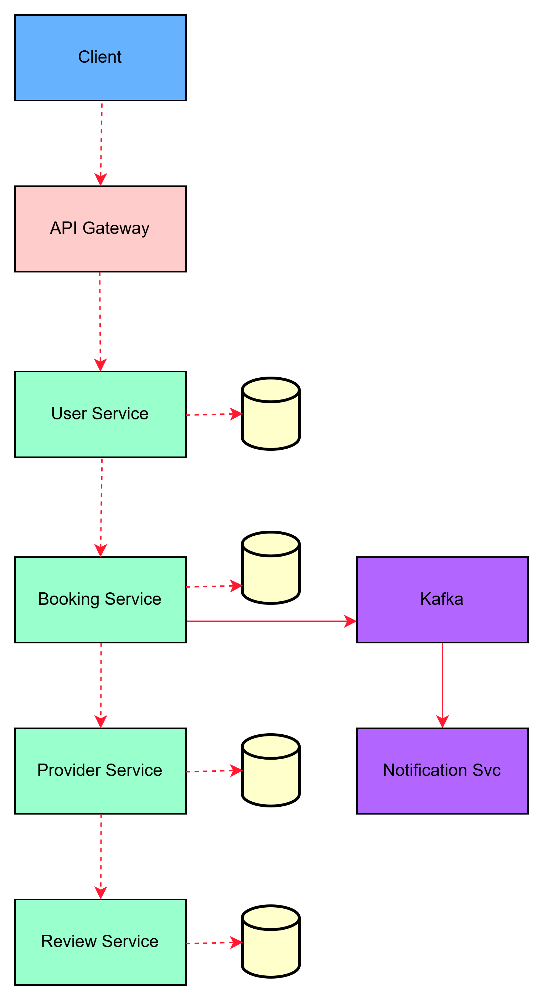

# Microservices Design

## User Service

Responsibilities:

- User registration
- Authentication
- Profile management

## Provider Service

Responsibilities:

- Manage carpenter profiles
- Skills and availability

## Booking Service

Responsibilities:

- Booking creation
- Booking status tracking

## Review Service

Responsibilities:

- Store ratings
- Maintain provider reputation

## Notification Service

Responsibilities:

- Send booking notifications
- Send alerts to providers